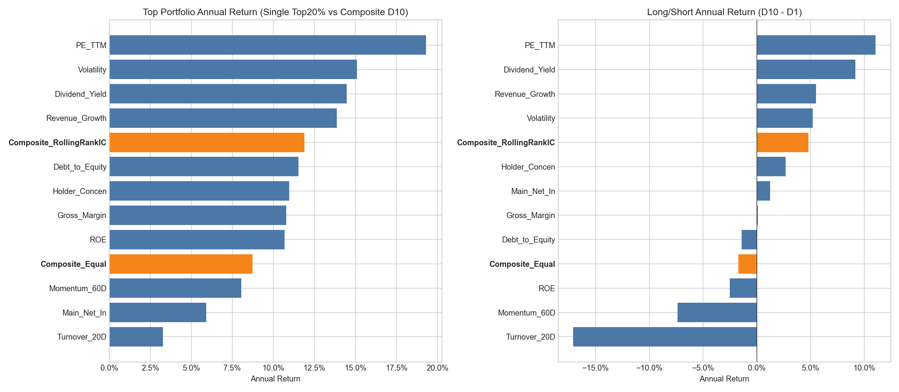

# 多因子合成与单因子对比回测报告

生成日期：2026-07-10  
数据来源：本地 `share_quant` 研究数据库与 `research/factor_combo/outputs/multifactor/` 回测输出  
样本区间：2022-01-01 至 2026-07-07  
调仓频率：月度调仓，月末信号，下一交易日成交  
交易成本：单边 10bp  
基准：中证全指 `000985.CSI`

## 1. 报告结论

本次回测显示，滚动 RankIC 加权多因子相较等权多因子有明显改善，但没有超过样本期内表现最强的若干单因子。

核心结论如下：

- 多因子等权合成效果较弱，D10-D1 年化收益为 `-1.70%`，说明简单平均会被弱因子和阶段性失效因子拖累。
- 滚动 RankIC 加权多因子显著优于等权合成，D10-D1 年化收益提升至 `4.82%`，RankIC 均值为 `5.69%`。
- 单因子中，`PE_TTM`、`Volatility`、`Dividend_Yield` 在当前样本期表现最强，单因子 Top20% 年化收益分别为 `19.30%`、`15.08%`、`14.47%`。
- 滚动 RankIC 多因子 D10 年化收益为 `11.89%`，低于最强单因子，但高于等权多因子 D10 的 `8.73%`。
- 当前结果在金融逻辑上合理：多因子合成牺牲了对样本期最强风格的集中暴露，换取更分散的因子风险和更好的跨风格稳健性。

简言之：如果只看当前样本期收益，最强单因子更优；如果考虑未来风格不确定性，滚动 RankIC 多因子更适合作为稳健组合信号的底座。

## 2. 回测口径

本次多因子合成基于已有 11 个单因子，先对单因子做方向统一、去极值、标准化，并进一步进行行业和市值中性化，再进行合成。

多因子版本包括：

| 因子组合 | 说明 |
|---|---|
| `Composite_Equal` | 对可用中性化单因子分数等权平均 |
| `Composite_RollingRankIC` | 使用过去 12 期 RankIC 均值作为权重，负权重截断为 0，历史不足或权重全为 0 时退回等权 |

股票池过滤规则：

- 已上市
- 非停牌
- 非 ST
- 每只股票每期至少有 6 个有效单因子分数

分层规则：

- 每期按综合分数从低到高分为 10 组
- D10 为最高分组
- D10-D1 表示最高分组减最低分组的多空收益

## 3. 样本覆盖情况

| 组合因子 | 调仓期数 | 首个信号日 | 最后信号日 | 平均有效股票数 | 最少有效股票数 | 平均可用因子数 |
|---|---:|---:|---:|---:|---:|---:|
| `Composite_Equal` | 54 | 20220128 | 20260630 | 4982 | 4423 | 10.27 |
| `Composite_RollingRankIC` | 54 | 20220128 | 20260630 | 4981 | 4423 | 10.27 |

覆盖率较充分。每期平均接近 5000 只股票，且每只股票平均可用因子数超过 10 个，说明多因子合成不是由少数样本或严重缺失驱动。

## 4. 多因子表现

### 4.1 Top 层组合表现

| 组合因子 | D10 年化收益 | 年化波动 | 最大回撤 | Sharpe | 年化超额 | 月均换手 |
|---|---:|---:|---:|---:|---:|---:|
| `Composite_RollingRankIC` | 11.89% | 21.99% | -28.30% | 0.54 | 8.78% | 28.22% |
| `Composite_Equal` | 8.73% | 25.20% | -31.20% | 0.35 | 5.62% | 39.93% |

滚动 RankIC 加权多因子的 D10 层在收益、波动、回撤、Sharpe 和换手上均优于等权多因子。  
这说明动态加权确实过滤了一部分弱因子影响，而不是简单增加复杂度。

### 4.2 多空表现

| 组合因子 | D10-D1 年化收益 | 年化波动 | Sharpe | 最大回撤 | 月度胜率 | 累计收益 |
|---|---:|---:|---:|---:|---:|---:|
| `Composite_RollingRankIC` | 4.82% | 15.66% | 0.31 | -21.68% | 59.26% | 23.60% |
| `Composite_Equal` | -1.70% | 12.24% | -0.14 | -20.36% | 44.44% | -7.43% |

等权合成的多空收益为负，说明它虽然能在多头组合中获得市场 beta，但排序能力不足。  
滚动 RankIC 加权多因子的多空收益转正，说明它具备一定横截面区分能力。

### 4.3 IC 表现

| 组合因子 | IC 均值 | IC 胜率 | RankIC 均值 | RankIC 胜率 | 年化 RankIC IR |
|---|---:|---:|---:|---:|---:|
| `Composite_RollingRankIC` | 2.24% | 59.26% | 5.69% | 68.52% | 1.55 |
| `Composite_Equal` | -0.14% | 48.15% | -0.53% | 40.74% | -0.21 |

RankIC 加权多因子相比等权多因子有明显提升，尤其 RankIC 胜率达到 `68.52%`。  
这表明动态权重机制确实捕捉到了阶段性有效因子。

## 5. 单因子与多因子对比

### 5.1 单因子 Top20% 表现

| 因子 | 年化收益 | 年化波动 | 最大回撤 | Sharpe | 年化超额 | 月均换手 |
|---|---:|---:|---:|---:|---:|---:|
| `PE_TTM` | 19.30% | 26.45% | -30.72% | 0.73 | 16.19% | 17.08% |
| `Volatility` | 15.08% | 22.00% | -30.91% | 0.69 | 11.97% | 12.59% |
| `Dividend_Yield` | 14.47% | 21.13% | -23.34% | 0.68 | 11.36% | 13.71% |
| `Revenue_Growth` | 13.86% | 26.16% | -34.87% | 0.53 | 10.75% | 13.36% |
| `Composite_RollingRankIC` D10 | 11.89% | 21.99% | -28.30% | 0.54 | 8.78% | 28.22% |
| `Composite_Equal` D10 | 8.73% | 25.20% | -31.20% | 0.35 | 5.62% | 39.93% |

从多头收益看，滚动 RankIC 多因子没有超过最强单因子。  
这并不异常，因为当前样本期内低估值、低波动、红利等风格表现较强，单因子集中暴露于这些风格时更容易获得高收益。

### 5.2 单因子 D10-D1 多空表现

| 因子 | D10-D1 年化收益 | 年化波动 | Sharpe | 最大回撤 | 月度胜率 |
|---|---:|---:|---:|---:|---:|
| `PE_TTM` | 11.04% | 10.31% | 1.07 | -6.16% | 57.41% |
| `Dividend_Yield` | 9.16% | 8.72% | 1.05 | -7.19% | 66.67% |
| `Revenue_Growth` | 5.51% | 8.05% | 0.68 | -14.48% | 55.56% |
| `Volatility` | 5.22% | 20.62% | 0.25 | -27.90% | 59.26% |
| `Composite_RollingRankIC` | 4.82% | 15.66% | 0.31 | -21.68% | 59.26% |
| `Composite_Equal` | -1.70% | 12.24% | -0.14 | -20.36% | 44.44% |

从多空排序能力看，`PE_TTM` 和 `Dividend_Yield` 仍显著强于多因子。  
但多因子明显优于等权合成，说明 RankIC 加权在降低弱因子拖累方面有效。

## 6. 为什么多因子跑不过部分单因子

### 6.1 样本期风格偏向明显

当前样本期内，价值、红利、低波动风格表现较强。  
`PE_TTM`、`Dividend_Yield`、`Volatility` 都直接受益于这类风格环境，因此单因子表现突出。

多因子合成不是只押这几个因子，而是纳入 11 个因子，因此会被其他弱因子稀释。

### 6.2 RankIC 权重是滞后的

滚动 RankIC 加权只使用过去 12 期历史信息。  
它不能提前知道未来哪一个因子最强，只能根据历史表现逐步调整权重。  
当市场风格快速切换时，RankIC 权重会天然滞后。

### 6.3 多因子目标不是样本内最优

单因子回测中表现最强的因子，往往是事后观察得到的。  
如果实盘前不知道未来哪一个因子会最强，直接选择样本内冠军单因子会有明显数据挖掘风险。

多因子的价值在于降低对单一因子的依赖，而不是保证超过每一个单因子。

### 6.4 弱因子仍会贡献噪声

当前滚动 RankIC 平均权重最高的因子为：

| 因子 | 平均权重 |
|---|---:|
| `Volatility` | 36.82% |
| `Dividend_Yield` | 20.97% |
| `PE_TTM` | 17.13% |
| `Main_Net_In` | 8.01% |
| `ROE` | 6.32% |
| `Revenue_Growth` | 6.19% |
| `Gross_Margin` | 2.71% |
| `Debt_to_Equity` | 1.19% |

权重确实集中到表现较好的因子上，但仍保留了一些贡献较弱的因子，因此收益不如直接押注最强单因子。

## 7. 多因子的实际价值

虽然多因子没有超过最强单因子，但它仍有研究价值。

### 7.1 降低单因子失效风险

单因子收益高度依赖特定市场风格。  
例如，低估值因子在价值风格占优时表现很好，但在成长风格占优时可能长期失效。  
多因子通过引入多个收益来源，可以降低单一因子失效带来的冲击。

### 7.2 更适合样本外使用

在真实投资中，无法事先知道未来哪个单因子会成为样本期冠军。  
多因子模型使用历史 IC 动态调权，比事后选择最强单因子更接近样本外决策过程。

### 7.3 提供因子轮动机制

滚动 RankIC 多因子会根据历史有效性调整权重。  
当某些因子持续失效时，其权重会被降低；当某些因子重新有效时，其权重会逐渐提高。

### 7.4 组合解释更完整

单因子策略容易暴露于单一风格。  
多因子策略可以同时观察估值、红利、低波、成长、盈利质量、资金流等维度，更适合作为组合研究框架。

## 8. 风险与不足

本次结果仍有以下不足：

1. 样本期较短，仅 54 个调仓期，对 RankIC 权重估计仍偏有限。
2. 分层收益不是严格单调，`Composite_RollingRankIC` 的 D10 平均收益高于 D1，但 D8/D9 也较强，说明排序信号仍有噪声。
3. 多因子没有做更严格的因子筛选，弱因子仍可能拖累组合。
4. 当前交易成本只使用单边 10bp，未考虑更真实的冲击成本、涨跌停成交约束和容量问题。
5. 当前对比仍基于同一历史样本，不能直接代表未来样本外表现。

## 9. 下一步建议

建议继续做三类扩展测试。

### 9.1 精选因子池

不要继续盲目增加因子，而是优先筛选长期 RankIC 为正且经济含义稳定的因子。  
候选因子包括：

- `PE_TTM`
- `Dividend_Yield`
- `Volatility`
- `Revenue_Growth`

然后比较精选多因子是否优于全量 11 因子合成。

### 9.2 分年度和分市场环境评估

按年度拆分：

- Top 组合收益
- D10-D1 收益
- RankIC
- 最大回撤

如果多因子不是每年第一，但多数年份排名靠前、回撤更小，则多因子的稳健性优势更明确。

### 9.3 滚动样本外冠军单因子对比

当前拿全样本最强单因子与多因子对比，对单因子有事后选择优势。  
更公平的方式是：

- 每个月只用过去数据选择当期最优单因子
- 用该单因子持有下一个月
- 与滚动 RankIC 多因子比较

这个测试更接近真实决策，也更能体现多因子的实际价值。

## 10. 总体判断

本次结果在金融逻辑上是自洽的：

- 等权多因子效果弱，说明不是所有因子都应平均使用。
- RankIC 加权多因子明显优于等权，说明动态因子权重有效。
- 多因子跑不过样本期最强单因子，说明当前样本中价值、红利、低波等单一风格较强。
- 多因子的核心价值不是追求样本内冠军，而是提升未来不确定环境下的稳健性。

因此，当前多因子模型可以作为研究底座继续优化，但暂不应直接视为优于最强单因子的最终策略。

