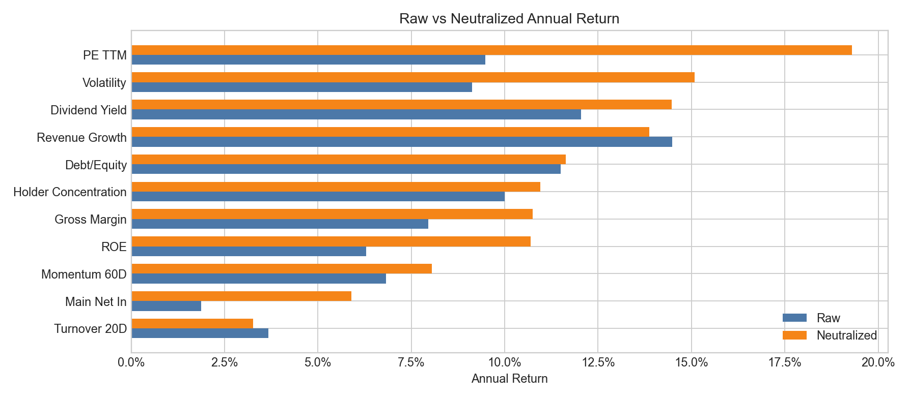
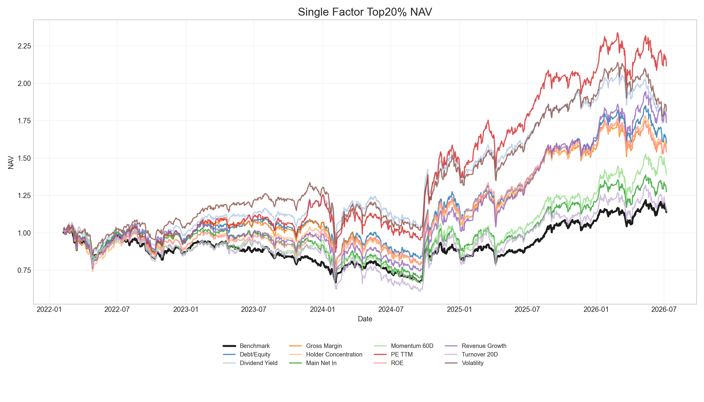
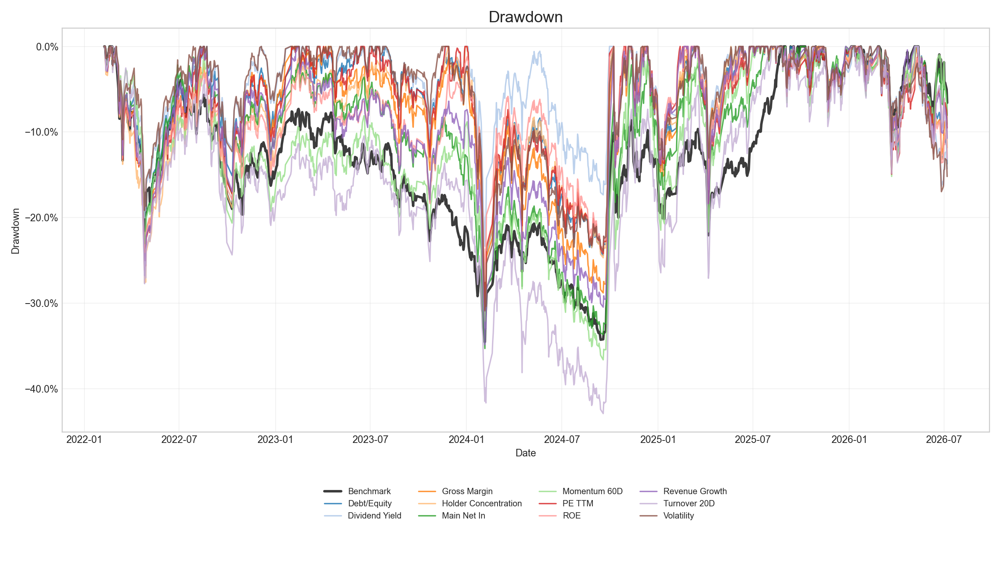

# 行业和市值中性化前后回测对比报告

## 1. 数据与输出引用

本报告基于本次主回测已经生成的 `outputs` 结果撰写，样本期为 `20220101` 至 `20260707`，基准为中证全指 `000985.CSI`，单边交易成本为 `0.10%`。

主要引用文件：

- 原始分数回测指标：[`../tables/factor_metrics.csv`](../tables/factor_metrics.csv)
- 中性化分数回测指标：[`tables/factor_metrics.csv`](tables/factor_metrics.csv)
- 中性化前后指标对比：[`tables/factor_metrics_comparison.csv`](tables/factor_metrics_comparison.csv)
- 中性化净值曲线：[`tables/nav_by_factor.csv`](tables/nav_by_factor.csv)
- 中性化调仓权重：[`tables/rebalance_weights.csv`](tables/rebalance_weights.csv)
- 指标对比图：
- 中性化净值图：
- 中性化回撤图：

## 2. 方法说明

原始回测使用当前主流程中的 `score` 排序选股。该 `score` 已经完成因子方向调整、去极值和截面标准化。

中性化回测不重新做去极值或标准化，而是在每个 `factor + trade_date` 截面上做如下回归：

```text
score ~ log(total_mv) + industry dummies
```

其中：

- `log(total_mv)` 来自 `daily_basic.total_mv`。
- 行业暴露来自 `v_industry_data` 的当期有效一级行业。
- 缺失行业填为 `Unknown`。
- 缺失市值在当期截面内用有效均值填补；若全截面缺失则填 0。
- 回归残差 `neutralized_score` 用于 Top20% 排序选股。

中性化前后使用相同的股票池、调仓日历、交易成本、持有期收益计算和基准，因此差异主要来自选股分数剔除行业与市值暴露后的变化。

## 3. 总体结论

中性化后，11 个因子中有 9 个因子的年化收益提高，2 个因子年化收益下降。改善最明显的是 `PE_TTM`、`Volatility`、`ROE` 和 `Main_Net_In`；下降的因子是 `Turnover_20D` 和 `Revenue_Growth`。

从排序看，原始回测中年化收益最高的是 `Revenue_Growth`，年化收益 `14.49%`；中性化后年化收益最高的是 `PE_TTM`，年化收益提升至 `19.30%`。这说明原始组合中的行业和市值暴露对因子排序有明显影响，尤其是估值和波动率类因子在中性化后表现更突出。

风险上，中性化并不总是降低回撤。`PE_TTM` 和 `Volatility` 的收益显著提升，但最大回撤分别从 `-17.91%`、`-22.43%`扩大到 `-30.72%`、`-30.91%`。相反，`ROE`、`Momentum_60D`、`Revenue_Growth`、`Debt_to_Equity` 等因子的最大回撤有所改善。

## 4. 核心指标对比

| 因子 | 原始年化收益 | 中性化年化收益 | 年化收益变化 | 原始 Sharpe | 中性化 Sharpe | 最大回撤变化 |
|---|---:|---:|---:|---:|---:|---:|
| PE_TTM | 9.47% | 19.30% | +9.83% | 0.50 | 0.73 | -12.81% |
| Volatility | 9.13% | 15.08% | +5.95% | 0.50 | 0.69 | -8.47% |
| ROE | 6.29% | 10.69% | +4.40% | 0.29 | 0.45 | +6.22% |
| Main_Net_In | 1.88% | 5.90% | +4.02% | 0.08 | 0.25 | +4.46% |
| Gross_Margin | 7.96% | 10.75% | +2.80% | 0.31 | 0.43 | +2.00% |
| Dividend_Yield | 12.05% | 14.47% | +2.42% | 0.62 | 0.68 | -3.89% |
| Momentum_60D | 6.82% | 8.05% | +1.23% | 0.25 | 0.30 | +6.48% |
| Holder_Concen | 10.00% | 10.96% | +0.96% | 0.42 | 0.44 | -0.84% |
| Debt_to_Equity | 11.50% | 11.63% | +0.13% | 0.42 | 0.48 | +5.20% |
| Turnover_20D | 3.67% | 3.26% | -0.41% | 0.12 | 0.11 | +1.51% |
| Revenue_Growth | 14.49% | 13.88% | -0.61% | 0.55 | 0.53 | +4.23% |

说明：最大回撤变化为“中性化最大回撤 - 原始最大回撤”。正值表示回撤变浅，负值表示回撤加深。

## 5. 因子表现解读

### 5.1 改善最明显的因子

`PE_TTM` 的改善最大，年化收益从 `9.47%` 提升到 `19.30%`，Sharpe 从 `0.50` 提升到 `0.73`。这表明原始估值因子的选股结果可能混入了较强的行业或市值结构，中性化后保留下来的估值残差信号更有效。

`Volatility` 年化收益从 `9.13%` 提升到 `15.08%`，Sharpe 从 `0.50` 提升到 `0.69`。低波或波动率相关信号通常容易受到行业防御属性和市值属性影响，中性化后收益改善，说明其截面残差信息仍然有效。

`ROE` 和 `Main_Net_In` 的收益与 Sharpe 均明显改善，并且最大回撤变浅。这类因子在中性化后收益质量改善更均衡，值得作为后续组合构建候选。

### 5.2 改善有限或下降的因子

`Debt_to_Equity` 年化收益几乎持平，但 Sharpe 从 `0.42` 提升到 `0.48`，最大回撤改善约 `5.20%`，说明中性化更多改善了风险形态，而不是显著提高收益。

`Turnover_20D` 和 `Revenue_Growth` 中性化后年化收益下降。其中 `Revenue_Growth` 原始表现排名第一，中性化后仍有 `13.88%` 年化收益，但相对原始下降 `0.61%`。这说明部分收益可能来自行业或市值暴露，也可能是中性化剔除了有用的结构性信息。

## 6. 风险与换手

中性化后部分因子的换手率上升。以月均换手看，`PE_TTM` 从 `10.45%` 上升到 `17.08%`，`ROE` 从 `12.73%` 上升到 `14.72%`，`Dividend_Yield` 从 `12.24%` 上升到 `13.71%`。这意味着中性化排序改变了持仓结构，可能带来更高交易成本敏感性。

`Main_Net_In` 的换手仍然最高，中性化后月均换手约 `71.71%`，虽然低于原始的 `74.78%`，但仍明显高于其他因子。若用于实盘或组合叠加，需要额外关注交易成本和容量。

回撤方面，`PE_TTM` 和 `Volatility` 虽然收益改善明显，但回撤加深，应避免只根据年化收益排序。更稳健的候选包括 `ROE`、`Debt_to_Equity`、`Gross_Margin` 和 `Revenue_Growth`，这些因子中性化后回撤有所改善或保持较好收益水平。

## 7. 后续建议

1. 将 `PE_TTM`、`Volatility`、`Dividend_Yield` 作为高收益中性化候选，但需要配合回撤约束。
2. 将 `ROE`、`Debt_to_Equity`、`Gross_Margin` 作为风险改善型候选，用于增强组合稳定性。
3. 对 `Revenue_Growth` 保留原始与中性化两版观察，因为原始收益更高，但中性化后回撤更浅。
4. 对 `Main_Net_In` 谨慎使用，收益改善明显但换手过高。
5. 后续组合层面建议同时比较原始分数组合、中性化分数组合和两者混合组合的收益、回撤、换手与行业暴露。

## 8. 附：关键输出路径

- 中性化报告：[`report.md`](report.md)
- 中性化指标表：[`tables/factor_metrics.csv`](tables/factor_metrics.csv)
- 中性化前后对比表：[`tables/factor_metrics_comparison.csv`](tables/factor_metrics_comparison.csv)
- 中性化权重表：[`tables/rebalance_weights.csv`](tables/rebalance_weights.csv)
- 年化收益对比图：[`images/raw_vs_neutralized_annual_return.png`](images/raw_vs_neutralized_annual_return.png)
- 指标对比图：[`images/metrics_comparison_table.png`](images/metrics_comparison_table.png)
- 净值曲线：[`images/nav_curve.png`](images/nav_curve.png)
- 回撤曲线：[`images/drawdown.png`](images/drawdown.png)
